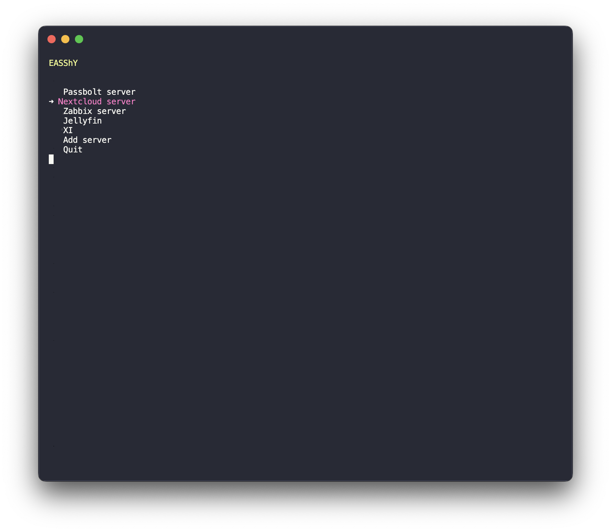

<div align="center">
  <h1><code>EASShY</code></h1>
  <p>EASShY is a simple Python script that allows you to manage your SSH server connections with ease. You can add, edit, delete, and connect to SSH servers using this script. It provides a text-based menu interface for quick and convenient server management.</p>
</div>



## Demo

https://github.com/Fastiraz/easshy/assets/92016718/0fef4358-7e06-41c2-8330-c04b1ebe0ed8

## Features

- Add new SSH server entries.
- Edit existing server details.
- Delete server entries.
- Connect to SSH servers with optional password or SSH key.
- Password encryption
- Password and fingerprint autofill (coming soon...)

## Requirements

- Python 3.x

## Installation

1. Clone or download this repository to your local machine.
2. Make sure you have Python 3.x installed.
3. Run the the following commands:

For Linux and macOS:
```bash
mkdir ~/.easshy

cd ~/.easshy

wget https://raw.githubusercontent.com/Fastiraz/easshy/main/easshy.py

wget https://raw.githubusercontent.com/Fastiraz/easshy/main/creds.json

echo 'alias easshy="python3 ~/.easshy/easshy.py"' >> ~/.bashrc

source ~/.bashrc  # For linux

source ~/.zshrc  # For macOS
```

## Usage

- Use the `easshy` command.
- Use the arrow keys to navigate the menu.
- Press Enter to select an option.
- You can add new servers, edit existing server details, or delete servers as needed.
- To connect to a server, select the "Connect to this server" option and follow the prompts.
